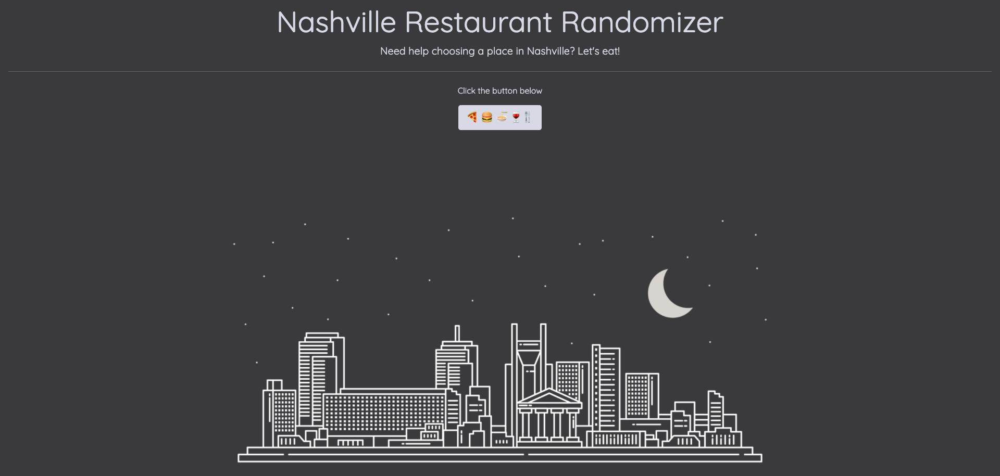
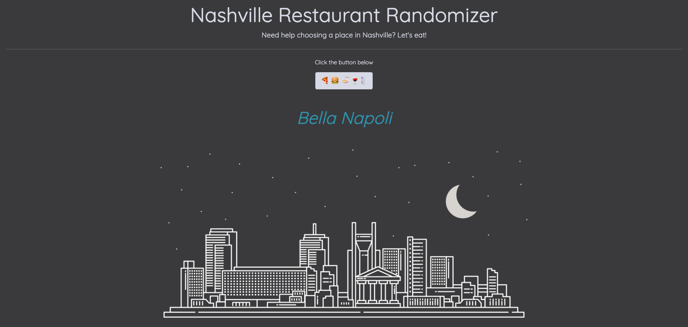

# Nashville Restaurant Randomizer

#### Overview
With the click of a button, a random Nashville area restaurant appears on the screen. Perfect for those who are having trouble picking one of the many dining experiences in town.

#### Deployed Project
[Link](https://nashville-restaurant-randomizer.netlify.app/) 

#### User description
This is perfect for the indecisive user who cannot choose a Nashville restaurant.

#### Features
- random restaurant chosen from an array of restaurants with the click of a button
- responsive design
- created with vanilla JavaScript, HTML, CSS, and Bootstrap
- new restaurants always being added
- new features to come!

#### Screenshots

#### Contributors
[Lindsey Satterfield](https://github.com/lindseysatterfield)